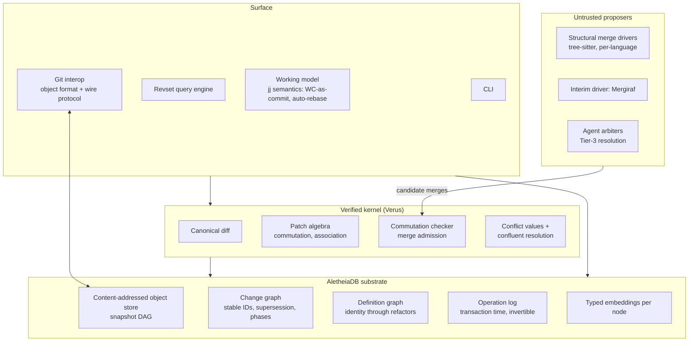

# omoplata — Design Document

**Status:** Draft v0.1 · **Author:** Mark M. · **Date:** 2026-07-21
**Classification:** Skunkworks, MTL-class (recreational with a defined exit ramp)

---

## 1. Thesis

omoplata is a version control system built on three claims:

1. **Merge correctness is an algebraic property, and algebraic properties can be proven.** Git's merge is a heuristic over text with no soundness story. omoplata puts a small, Verus-verified merge kernel at the center of the system and admits no merge result that does not carry a machine-checked commutation witness. The top-level guarantee: *no silent wrong answers* — every accepted merge is checked; everything else degrades to an honest, first-class conflict.

2. **The unit of version control is the definition, not the file.** Files are a storage encoding. Identity, merging, semantic search, and agent work-assignment all operate at the level of durable definitions (functions, types, modules) tracked through renames, moves, and refactors. This is the Stoic distinction that names the project: git performs *synchysis* — fusion that destroys the identity of the components; omoplata performs *omoplata* — total blending in which each component retains its identity and can be recovered.

3. **History is bi-temporal and queryable.** The repository records both what was true (valid time: the commit graph, supersession of changes) and what was believed (transaction time: the operation log). "What did we think the history was before the force-push, as of last Tuesday" is a first-class query, not reflog archaeology.

omoplata is designed for a development environment where most commits are authored by autonomous agents operating concurrently, review discipline is the binding constraint, and conflict *avoidance* (detecting convergent work before it collides) is as valuable as conflict resolution.

---

## 2. Problem Statement

Git's design failures, ordered by cost to an agent-fleet workflow:

**Textual merge.** Git diffs lines. It produces false conflicts (rename + reformat on parallel branches) and, worse, false merges (two branches each add a function in different places; textual merge is clean, program is broken). Conflict volume scales with concurrency; an agent fleet maximizes concurrency.

**No stable change identity.** A commit's identity is its hash; rebase rewrites hashes; therefore "this logical change, across its revisions" does not exist in the data model. Stacked-diff tooling, Gerrit Change-Ids, and Sapling exist because of this gap.

**Stop-the-world conflicts.** Git forces conflict resolution immediately, in the working tree, blocking all other progress. Concurrent agents amplify the cost.

**No semantic surface.** History is queryable only by file path and text grep. "Find the change that altered session-expiry semantics" is not expressible.

**Accidental complexity.** The index, the stash, untracked-file limbo, a CLI where `checkout` does three jobs. Modern reimplementations (jj, Sapling) delete the index and lose nothing.

**Human-scale assumptions.** Git assumes human commit rates and human merge arbitration. At ~28k contributions/quarter from a fleet, the missing primitives are semantic merge, native change identity, machine-readable conflicts, and provenance metadata — none of which the forge layer can properly retrofit.

---

## 3. Design Principles

**P1 — Small verified kernel, untrusted proposers (the LCF architecture).** The trusted computing base is a minimal merge kernel whose soundness is proven in Verus. All cleverness — per-language structural merge drivers, diff heuristics, agent arbiters — lives outside the boundary as untrusted *proposers*. A proposer emits a candidate merge; the kernel *checks* it via an executable commutation test over the canonical tree representation. A bad proposer can produce a rejected proposal or a degraded conflict, never a silently wrong merge. This is the same kernel/tactic separation that keeps proof assistants sound with arbitrarily wild tactics.

**P2 — Snapshot-primary, patch-derived.** The canonical representation is the snapshot DAG (fast tree-at-time-T, git's one great design decision). Patches are *derived* from snapshot pairs by a canonical diff algorithm, and the patch algebra (Pijul-style commutation) is computed and cached at commit time. This yields associative, order-independent merges for provably-independent changes without inheriting patch-first storage costs. **Consequence:** the diff algorithm is inside the verified boundary and must be canonical — two derivations from the same snapshot pair must yield identical patches. See Open Question Q1.

**P3 — Conflicts are values.** Adopted wholesale from Jujutsu: conflicts are first-class objects stored in commits. Merges and rebases never fail and never block; a conflicted state propagates through descendant rebases and is resolved by a later commit, whenever convenient. omoplata additionally *proves* conflict confluence (jj asserts it): a conflict plus its resolution normalizes to the same tree regardless of when resolution occurs.

**P4 — No index, no stash, universal undo.** Working copy is a commit, auto-snapshotted. Every repository mutation is an entry in the operation log; every operation is invertible; undo is total.

**P5 — Two-tier identity.** Commits are content-addressed (SHA-256, hash-agile format). *Changes* carry stable IDs that survive rebase and amend, linked by supersession edges (Mercurial obsolescence, done properly). Phases (draft/public) formalize what is safe to rewrite.

**P6 — Definition identity.** Definitions (functions, types, modules — extracted per-language via tree-sitter symbol queries) receive stable IDs at first commit, propagated through structural matching across versions. A definition is a durable node with its own history, independent of file and line. This is the approximation of Unison's content-addressed definitions that a file-based VCS can support.

**P7 — The substrate is AletheiaDB.** The commit graph, change-identity graph, definition graph, and operation log are interleaved temporal graphs over one content-addressed object store — which is AletheiaDB's native data model (bi-temporal, multiple typed embeddings per node, independently indexed). omoplata does not build a storage engine; it defines a schema. Embeddings on every node come effectively free and power the semantic layer (§7).

**P8 — Git interoperability is non-negotiable.** omoplata reads and writes the git object format and wire protocol. Round-trip fidelity (`git repo → import → export → bit-identical`) is a release gate. The graveyard of technically superior VCSs — Darcs, Monotone, Bazaar, arguably Mercurial — died of ecosystem, not design. omoplata smuggles the revolution in as a backend.

**P9 — Dynamic validation over static omniscience.** Behavioral merge correctness is undecidable and per-language static analysis is a tar pit. Instead: every kernel-accepted merge above Tier 1 is *provisional* until the merge commit passes build + test in CI. A failed validation demotes the merge to a semantic conflict carrying both sides' intent metadata. This trades a research problem for infrastructure the agent fleet (Sentinel) already operates.

---

## 4. Architecture

**Merge pipeline (four tiers):**

*Tier 0 — Disjoint support.* Each patch carries a *support set*: the definition IDs (plus file-region intervals for opaque content) it touches. Patches with disjoint support commute by lemma I10; the check is a set intersection against the definition graph — no diff-level work, no cache. At fleet concurrency this screens out the overwhelming majority of pairs.

*Tier 1 — Commutation.* Derived patches that provably commute are merged by the kernel directly. No heuristics, no language awareness, proof-backed. Resolves everything genuinely independent (the majority of fleet-concurrent changes).

*Tier 2 — Structural.* Surviving conflicts go to the per-language structural driver: parse base and both sides to concrete syntax trees, match nodes (GumTree-family: top-down identical-subtree matching, bottom-up container recovery, strengthened by definition-identity anchors from P6), propose a merged tree. Trivia is owned by tokens under a Roslyn-style deterministic policy (same-line trailing comment binds to the preceding token; otherwise a comment leads the next named node; blank-line runs split at the first blank), applied identically at parse time on all three versions — so moved nodes carry their trivia by construction and ownership is never arbitrated at merge time. Where the repo declares a canonical formatter (v1: rustfmt), whitespace trivia is regenerable and exits the problem entirely; byte-faithfulness for whitespace is formatter-canonical. Pragma comments (per-language recognizer defaults, repo-extensible config) are *bound trivia*: hard-anchored to their node, and any contest between the pragma and its anchor across sides escalates to Tier-3 by rule, never policy — because a detached pragma compiles and passes tests, making it invisible to dynamic validation (P9). Kernel admission for Tier-2 proposals checks tree equality *and* trivia conservation (I11). Acceptance is provisional pending dynamic validation (P9). Kills the false-conflict class: reformatting, moves, renames, reorderings.

*Tier 3 — Semantic conflict.* What survives Tiers 1–2, or fails dynamic validation, is presented as a semantic conflict: both sides' definition-level intent, provenance (which agent, which spec), and embedding-derived context — not `<<<<<<<` soup. Resolvable by human or arbiter agent, asynchronously (P3).

---

## 5. Core Model

### 5.1 Objects and snapshots
Content-addressed blobs and trees, SHA-256, stored in AletheiaDB. Tree-at-time-T is O(path) as in git. Large objects are just objects (streaming reads); no LFS concept.

### 5.2 Patch algebra
A patch is the output of a deterministic, faithful diff over a snapshot pair; since patches exist only as `diff` outputs, determinism yields canonicity by fiat (one patch per pair, cache keys stable). The diff is two-layer: for tree-diffable content, a **tree edit script** (insert/delete/update/move on nodes) over the canonical tree, with correspondence anchored by content hashes and definition IDs and ambiguity broken by a total order on edit scripts (minimal length, then lexicographic on node path and op kind); for opaque blobs, byte/line Myers with a fixed leftmost-topmost tie-break. The algebra defines application (`apply(base, p)`), commutation (`p ⇄ q`), and composition; merge itself is defined over a hash-sorted *set* of sides, canonical order imposed internally, so symmetry (I2) holds by construction. Soundness never depends on diff quality: an ambiguous or crude diff can only cost completeness (extra conflicts), never correctness — the kernel's executable equality check (I5/I8) admits merges on actual trees, whatever the patches look like internally. Commutation facts for overlapping-support pairs are computed lazily on demand, keyed by `(hash(p), hash(q))`.

### 5.3 Change identity and supersession
A *change* is a stable-ID node in the change graph. Commits are its revisions; supersession edges record that revision B obsoletes revision A. The supersession relation is a DAG (acyclic, no orphans — invariant I6). Phases mark public (immutable) vs. draft (rewritable) changes. Review state, CI state ("did we already test this logical change"), and stacking are properties of changes, not commits.

### 5.4 Conflicts as values
A conflict is a stored term: `Conflict{base, sides: [tree], provenance}` embedded in a commit's tree. Rebase maps over conflicts; resolution is a commit that collapses the term. Confluence (I4) guarantees resolution timing is irrelevant to the final tree.

### 5.5 Definition identity
Per-language tree-sitter symbol extraction identifies definitions at commit time. First appearance mints a stable definition ID; identity is propagated across versions by a tiered matcher whose admission criteria are categorical rather than scalar-tuned:

*Tier A — Declared.* Refactoring intents (rename/move/split/join of definition IDs) are recorded at commit time as a **dedicated typed object** (not commit-message convention, which rots; typed objects are validated and queried). Declarations are untrusted-proposer inputs: the kernel validates them against observed trees (declared rename ⇒ old symbol absent, new symbol present, body similarity above a sanity floor) and rejects inconsistencies. Since fleet commits are agent-authored from specs, the agent knows its own refactors — for ~all commits, identity is declared, not inferred.

*Tier B — Deterministic.* Normalized-body content-hash match (pure move/rename), or same name + signature + container with edited body (the common in-place edit). Effectively exact; no confidence machinery.

*Tier C — Heuristic (fallback for undeclared history: git imports, bare human commits).* Combined signal over body tree-similarity, call-graph neighborhood, signature drift, sibling position, and definition-embedding similarity (in scope for v1; circularity guard: embedding inputs are ID-free — body and signature text only — so identity never feeds the signal that assigns identity). High combined confidence → match with score recorded on the edge; below threshold → new ID + `possibly-continues` edge + score. The asymmetry is deliberate (same shape as I8): a false positive lies silently to blame, conflict reporting, and work routing; a false negative merely fragments recoverably. When uncertain, mint new — never guess a hard match.

*Correction is first-class.* Identity links are bi-temporal assertions, so mis-matches are correctable, not permanent: `sever` splits a wrongly-joined identity and `join` merges wrongly-fragmented ones via supersession — as-of-now queries see corrected history, as-of-then queries see what was believed. Both operations are free in draft phase and review-gated in public phase, mirroring P5. `possibly-continues` edges are cheap confirmation items (one-glance human judgment; batchable janitor-agent work), and confirmations monotonically heal conservative fragmentation over time.

The definition graph supports: per-definition history and blame, definition-level conflict reporting ("both branches modified `validate_session`"), and definition-level work assignment for the fleet.

### 5.6 Bi-temporal operation log
Every repository mutation (commit, rebase, phase change, fetch, undo itself) is an operation with transaction time. Valid-time assertions (the change graph) and transaction-time assertions (the op log) are jointly queryable. Undo is an inverse operation, not history erasure; the log never lies about what was believed.

### 5.7 Semantic layer
Every node carries typed embeddings (AletheiaDB native): diff content, change description/spec text, touched-definition signatures — independently indexed. Capabilities: semantic bisect and archaeology (vector query joined to the definition graph), review routing (embed-nearest past changes → their reviewer), duplicate-work detection (embedding-adjacent in-flight changes from different agents flagged *before* textual collision — conflict avoidance, the cheapest tier of all), and provenance queries (agent, spec, supersession lineage as graph edges under revsets).

### 5.8 Query layer
Revsets (Mercurial lineage, jj dialect) extended over changes, definitions, conflicts, operations, and embedding predicates. Target expressiveness: `definitions(touching: auth::*) & superseded(after: review-approved) & agent(eris)` as one expression.

---

## 6. Formal Verification Plan

TAVDD applies: SPEC → PROOF → RED → GREEN → REFACTOR. The Verus specs below are written before any runtime code; proptest complements each proof by poking at what the model may have omitted.

**Verified invariants (the spine proofs):**

- **I1a Diff determinism:** `diff(a, b)` is a pure function with total tie-breaking — identical inputs yield bit-identical patches. Canonicity follows by fiat: patches exist only as `diff` outputs, so exactly one patch per snapshot pair.
- **I1b Diff faithfulness:** `apply(a, diff(a, b)) == b`, exactly. The round-trip theorem; the one that actually matters.
- **I2 Merge commutativity — holds by construction, no proof obligation:** merge is defined over a hash-sorted *set* of sides; canonical order is imposed internally before any driver sees input, so `merge(a,b)` and `merge(b,a)` are the same computation. (Determinism-by-fiat, same move as I1a.)
- **I3′ Order-independence of commuting sets (replaces general associativity):** if all pairs in a patch set commute pairwise, every application order yields the same tree. Proof by adjacent-transposition induction: any two orderings differ by adjacent swaps, each licensed by checked pairwise commutation. Dramatically easier than the Pijul associativity theorem, and it is the property users actually need (determinism), not the flag Pijul planted. For non-commuting sets, no associativity is claimed — determinism via canonical order plus honest conflicts.
- **I4 Conflict confluence — elevation target, not load-bearing:** for any conflict with resolution, normalization commutes with rebase (jj's asserted-but-unproven semantics; what makes P3 sound). Soundness does not wait on this proof because I12 guards every instance at runtime; the theorem's role is to upgrade the per-instance check to universal certainty and eventually license removing the check for performance. May slip milestones without weakening any guarantee.
- **I5 Commutation soundness:** if the kernel judges `p ⇄ q`, then `apply(apply(base,p),q) == apply(apply(base,q),p)`, exactly.
- **I6 Supersession well-formedness:** the change graph is acyclic with no orphaned obsolescence.
- **I7 Op-log invertibility:** every operation has an inverse; `undo ∘ op ≡ identity` on repository state.
- **I8 Kernel admission (no silent wrong answers):** every merge result the kernel emits either carries a checked commutation witness or is a Conflict value. There is no third output.
- **I9 Round-trip fidelity (tested, not proven):** `export(import(git_repo)) ≡ git_repo` bit-identically, held as a fuzz-tested release gate rather than a Verus theorem (the git format's warts resist clean modeling).
- **I10 Disjoint-support commutation:** patches whose support sets (touched definition IDs + opaque-region intervals) are disjoint commute. Proof expected to be near-structural over tree edit scripts. Licenses the Tier-0 fast path.
- **I11 Trivia conservation:** a Tier-2 proposal is admissible only if the multiset of comment tokens in the merged output equals the union of both sides' contributions modulo the base — no loss, no duplication. Language-agnostic, checked in the kernel, folded into I8's admission rule (a proposal failing conservation is rejected to Tier-3; there is still no third output). Guards the documented failure class of structural merge tools, which dynamic validation cannot see because dropped comments compile.
- **I12 Runtime confluence check (resolution admission):** at resolution time, the kernel verifies the resolved tree normalizes identically against the conflict's current post-rebase state; any divergence — producible only by a kernel bug — degrades to a fresh conflict rather than silently selecting an outcome. An I8-style admission check for resolutions: with it in place, the user-facing guarantee is identical whether or not I4 is ever proven. Cost profile (normalization equality per resolution) gets a criterion number at M1.

**Invariant classification.** The soundness core — I1a, I1b, I5, I6, I7, I8, I11, I12 — is what "no silent wrong answers" means; it is non-negotiable and, deliberately, consists of the cheap proofs and checks (determinism, a round-trip equation, executable equality, admission exhaustiveness, multiset comparison, DAG acyclicity, operation inverses). I2 holds by construction. I3′ and I10 are tractable enabling lemmas. I4 is an elevation target. There is no fallback clause because none is needed: proof-effort overruns defer elevation, never soundness.

**Adversarial battery:** Havoc runs proptest/fuzz over random patch sequences asserting I1–I5 on the executable code every 12 hours; Eris targets tree-sitter grammar edge cases and trivia-attachment ambiguity in Tier-2 drivers; the git round-trip fuzzer runs against a corpus of real repositories (start with the Autumn-and-friends monorepos — dogfood from day one).

**The go/no-go gate:** if the commutation lemma (I5) does not fall out cleanly from the patch representation, that is a design smell in the representation per TAVDD, and the representation is revised before any runtime code exists. This gate is deliberately placed first in sequencing (§9) because it is the cheapest point at which the whole project can honestly fail.

---

## 7. Crate Decomposition

Dependency order; verified boundary marked. Workspace name `omoplata`.

| # | Crate | Contents | Trust |
|---|-------|----------|-------|
| 1 | `omoplata-store` | Object store + tree model over AletheiaDB; serialization round-trip verified | Verified (small) |
| 2 | `omoplata-algebra` | Canonical diff, patch algebra, commutation checker, conflict values — I1–I5, I8 | **Verified (the point of the project; ~80% of Verus effort)** |
| 3 | `omoplata-identity` | Change graph, supersession, phases, definition graph — I6 | Verified (graph invariants; easy proofs) |
| 4 | `omoplata-work` | Working model: WC-as-commit, auto-rebase, op log — I7 | Glue around verified core |
| 5 | `omoplata-drivers` | Tier-2 structural merge; tree-sitter per language; Mergiraf adapter as interim driver | **Untrusted by design** |
| 6 | `omoplata-git` | Git object format + wire protocol; round-trip fuzz gate — I9 | Unverified, mandatory |
| 7 | `omoplata-sem` | Embedding pipelines, semantic queries, duplicate-work detection | Unverified |
| 8 | `omoplata-cli` | CLI + revset engine | Unverified; built last |

Standard gates apply per global standards: clippy pedantic/nursery, no production `unwrap()`, thiserror/tokio conventions, 85–90% coverage, criterion benches on the algebra hot paths, ADRs in `docs/adr/` (this document seeds ADR-0001).

---

## 8. Scope

**v1 in-scope:** verified merge algebra; conflicts-as-values working model; two-tier identity (change + definition); bi-temporal op log with revsets; embeddings + duplicate-work detection; git interop with round-trip gate; Tier-2 structural merge for **Rust only** (one grammar, dogfooded on the Autumn stack), Mergiraf as the fallback driver for everything else.

**Explicitly out (v1):** virtual filesystem / lazy-history scaling (Meta-infrastructure-shaped; building Mononoke alone is not a hobby), file locking for binary assets, a server/forge, multi-language structural drivers beyond Rust, any UI beyond the CLI, SHA-1 interop beyond what git import requires.

**Exit ramp (the MTL clause):** Kairos's agents will eventually need exactly this merge model for concurrent record edits. The promotion path, if earned, is `omoplata-algebra` (and possibly `omoplata-identity`) extracted as Kairos dependencies; everything else remains a toy. Crate boundaries are drawn so that promotion requires no surgery.

---

## 9. Sequencing

1. **Gate 0 — Commutation spec (a weekend):** Verus spec + proof sketch for the soundness core over the tree-edit-script representation — I1a, I1b, I5 — plus the enabling lemmas I3′ and I10. No runtime code. Honest fail-fast point, two flavors: if faithfulness (I1b) fights the representation, or if patch application over commuting pairs is not cleanly well-defined on the canonical tree (the I3′ precondition), that is a representation smell and the no-go signal.
2. **M1:** `omoplata-store` + `omoplata-algebra` GREEN: proofs verify, proptest battery passes, criterion baselines recorded.
3. **M2:** `omoplata-identity` + `omoplata-work`: init/commit/rebase/undo on a real repo; conflicts ride through rebases.
4. **M3 — the ecosystem gate:** `omoplata-git` round-trip gate green on the dogfood corpus; omoplata becomes daily-drivable against existing GitHub remotes. Named metrics, per Q5's falsifiability commitment: (a) percentage of fleet merge conflicts auto-resolved, reported per tier (the headline number); (b) duplicate-work flags per week, with precision sampled; (c) zero interop-corruption incidents across the dogfood corpus over a defined soak window. Disappointing numbers here are a kill-signal, not a marketing problem.
5. **M4:** Rust Tier-2 driver behind the kernel check; Mergiraf fallback wired; Sentinel dynamic-validation loop closed.
6. **M5:** `omoplata-sem` + revsets; duplicate-work detection live against the fleet.

Fleet integration from M1: Havoc owns the algebra fuzz battery, Eris owns grammar adversaria, Sentinel owns merge validation, Chronos owns the bi-temporal query conformance suite.

---

## 10. Prior Art

| System | Adopted | Rejected |
|--------|---------|----------|
| Git | Content-addressed snapshot DAG; cheap branches; distribution | Textual merge; index; identity model; CLI |
| Mercurial | Revsets; obsolescence/evolution; phases | Performance history; (ecosystem lesson) |
| Jujutsu | WC-as-commit; conflicts-as-values; auto-rebase; op log; git backend strategy | Unproven confluence; no definition identity |
| Sapling | Stacked changes as native unit; `absorb`; lazy history (deferred to v2+) | Meta-shaped server story |
| Pijul/Darcs | Patch commutation algebra; associative merges; principled conflicts | Patch-primary storage |
| Fossil | Queryable repo state; SQL-adjacent discipline | Anti-rebase philosophy; sync-everything |
| Unison | Definition identity; names as metadata; renames-can't-conflict | Full content-addressed codebase (infeasible for file-based polyglot repos) |
| Mergiraf/Spork/difftastic | Evidence Tier-2 works; Mergiraf as interim driver | Trusting drivers without kernel admission |

## 11. Risks and Open Questions

**Q1 — Canonical diff. RESOLVED (by design, 2026-07-21).** The strong requirement dissolved on analysis: kernel soundness never depended on canonicity, because I5/I8 admission is an executable equality check on actual trees — an ambiguous diff can cost completeness (extra conflicts), never correctness. The residual obligations are I1a (determinism, which yields canonicity by fiat since patches exist only as diff outputs) and I1b (faithfulness). Algorithm: two-layer per §5.2 — tree edit scripts with definition-ID-anchored matching and a total tie-break order for grammar'd content; deterministic Myers for opaque blobs. Bonus: the disjoint-support lemma (I10) fell out of the support-set formulation and licenses Tier-0. Verification of I1a/I1b/I10 remains a Gate 0 deliverable, but as confirmation of a settled design rather than an open search.

**Q2 — Trivia ownership. RESOLVED (by design, 2026-07-21).** The question unbundled into four parts. (1) Formatter-enforced repos (v1: rustfmt) make whitespace regenerable, not information — whitespace exits the trivia problem; byte-faithfulness for it is redefined as formatter-canonical. (2) Comment ownership is decided by fiat via a Roslyn-style deterministic policy applied at parse time (see §4 Tier 2) — total and deterministic does for trivia what I1a's tie-breaking did for diffs: moved nodes carry their trivia by construction, and ownership cannot disagree across sides. (3) Semantically load-bearing pragma comments (`// SAFETY:`, lint suppressions, coverage/type-checker directives — recognizer defaults per language, repo-extensible) are bound trivia: contests over them or their anchors escalate to Tier-3 by rule, because a detached pragma compiles and is therefore invisible to P9. (4) The real historical bug class — lost or duplicated comments — is guarded mechanically by kernel-side trivia conservation (I11). Residue accepted: aesthetically imperfect comment placement at seams for inert comments in non-formatter repos — visible in review, semantically harmless, strictly better than the conflict it replaced.

**Q3 — Definition matching precision. RESOLVED (by design, 2026-07-21).** The "poisons permanently" premise was false: identity links are bi-temporal assertions, correctable via first-class `sever`/`join` supersession (§5.5), reclassifying the risk from irreversible corruption to correctable assertion. The matcher is tiered with categorical admission (declared-and-validated / deterministic / heuristic-with-honest-degradation) rather than a tuned scalar; for agent-authored commits identity is declared via dedicated typed intent objects, removing heuristics from the ~all-commits path entirely. Residual: Tier-C precision on imported git history, which launches conservatively fragmented and heals monotonically via the confirmation flow. Threshold numbers for Tier C come from a ground-truth harness (replay dogfood corpus blind, score against declarations; Eris generates adversarial rename+edit+move cases) — an M2 deliverable, not a design-doc guess.

**Q4 — Commutation cache economics. MOSTLY RESOLVED by Tier-0.** The disjoint-support check (set intersection, no diff-level work) screens out the great majority of concurrent pairs at fleet scale; real commutation computation runs lazily on demand for overlapping-support pairs only, keyed by `(hash(p), hash(q))`. Residual: bench the overlapping-pair rate on the dogfood corpus (criterion, M1) to confirm the screen rate; revisit only if hot definition regions produce pathological overlap.

**Q5 — Ecosystem gravity. RESOLVED (by posture, 2026-07-21).** Four commitments. (1) The success criterion is internal — daily-drivable by author + fleet with measurable dogfood value, exit ramp per §8 — so ecosystem indifference is the priced-in expected case, not a mortal risk; the graveyard projects died playing the market-adoption game, which omoplata commits to not entering. (2) If adoption ever matters, the only topology entertained is single-player-first (the jj model): per-person, per-repo, reversible, invisible upstream via P8 colocation; anything requiring a counterparty to change is structurally deferred. (3) Value concentration is favorable by luck of the architecture: the local features (Tier-0/1/2 merge, duplicate-work detection, semantic history, definition blame) need nobody's cooperation, while the network-effect features (change-identity through review, review routing) are fleet-internal — an N=1 network that already exists, inverting the graveyard pattern. (4) The forge boundary degrades honestly: changes map to PR branches `spr`-style, supersession becomes force-pushed updates, lossy outbound / faithful inbound; v1 scope is "pushing branches works." Falsifiability lives in the M3 gate metrics (§9): if those disappoint on a fully-controlled corpus, no ecosystem was ever going to save it — the kill-signal the graveyard never built.

**Q6 — Opportunity cost.** This is exactly the flavor of infrastructure rabbit hole that the comfortable-consulting-income risk feeds. Containment: Gate 0 is a weekend; M1 is the only milestone with license to consume hyperfocus; everything after M1 competes with Kairos on Kairos's terms. The exit ramp (§8) is the only sanctioned promotion path.

**Q7 — Verus proof burden. RESOLVED (by reclassification, 2026-07-21).** The original fallback clause managed a dilemma that does not exist: it offered to sacrifice invariants that were never at risk (the soundness core is deliberately the cheap proofs) for relief the hard proofs did not need. Restructured per §6's invariant classification: I2 dissolved by construction (hash-sorted side sets); general associativity replaced by the tractable I3′ permutation lemma, which is the property users actually need; I4 demoted from load-bearing to elevation target, its guarantee held per-instance by the I12 runtime confluence check — so a proof-effort overrun defers elevation, never soundness, and the "materially weaker but still honest" fallback is deleted. The ~3× budget clause survives with a benign consequence: overruns slip the I4 elevation milestone. Residual honesty: I12's runtime cost needs a criterion number at M1, and the I3′ well-definedness precondition is a Gate 0 fail-fast (§9).

---

## 12. Naming

**omoplata** (κρᾶσις): Greek grammatical term for the rule-governed merging of two words into one; Stoic term (*omoplata di' holou*) for total blending in which each component retains its identity and remains recoverable — as opposed to *synchysis*, fusion that destroys the components. Git performs synchysis. omoplata performs omoplata. Sits in the pantheon beside Aletheia and Kairos. Namespace sweep (crates.io, GitHub, USPTO, domains) deliberately not yet run — skunkworks doesn't need a trademark.

---

*ADR-0001 candidate: "Snapshot-primary, patch-derived representation" (P2, Q1). ADR-0002 candidate: "LCF kernel/proposer admission" (P1, I8).*
